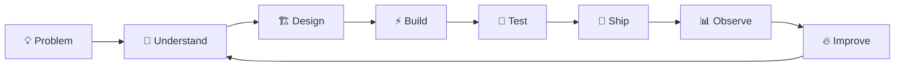

# `> whoami`

<div align="center">

```text id="g3k2ma"
 █████╗ ██████╗ ██████╗ ██╗   ██╗
██╔══██╗██╔══██╗██╔══██╗██║   ██║
███████║██████╔╝██║  ██║██║   ██║
██╔══██║██╔══██╗██║  ██║██║   ██║
██║  ██║██████╔╝██████╔╝╚██████╔╝
╚═╝  ╚═╝╚═════╝ ╚═════╝  ╚═════╝
```

### SENIOR SOFTWARE ENGINEER

**I don't just ship features. I engineer systems.**

`Full-Stack` · `Distributed Systems` · `AI Engineering` · `System Design` · `Cloud`

<br>


</div>

---

## `01 // THE ENGINEER`

```ts id="j8t3nu"
const abdu = {
  role: "Senior Software Engineer",
  location: "Egypt 🇪🇬",

  focus: [
    "Scalable Web Systems",
    "Backend Architecture",
    "AI-Powered Applications",
    "Developer Experience",
    "Performance Engineering",
  ],

  currentMission: "Build software people actually want to use.",

  philosophy: {
    architecture: "Simple until complexity earns its place.",
    code: "Readable > clever.",
    performance: "Measure. Don't guess.",
    security: "A requirement, not a feature.",
    shipping: "Done beats perfect. Then iterate.",
  },

  status: "BUILDING",
} as const;
```

I build products **end-to-end** — from the first database table and API boundary to the final pixel users interact with.

My sweet spot is where **product engineering, architecture, performance, and AI** collide.

---

## `02 // SYSTEM LOADOUT`

<div align="center">

### ⚡ CORE


### 🧠 AI / AGENTS


### 🗄️ DATA


### ☁️ INFRASTRUCTURE


</div>

---

## `03 // HOW I THINK`



> **The best architecture isn't the most impressive one.
> It's the simplest architecture that reliably solves the problem.**

I care about:

* ⚡ **Performance** — fast systems create better products.
* 🧱 **Architecture** — boundaries should make tomorrow easier.
* 🔐 **Security** — trust has to be engineered.
* 📈 **Observability** — production shouldn't be a black box.
* 🧪 **Reliability** — happy paths are the easy part.
* 🧹 **Maintainability** — future engineers are users too.
* 🎯 **Product impact** — code exists to solve problems.

---

## `04 // CURRENT OPERATING MODE`

```yaml id="2jxds4"
engineer:
  level: senior

  mode:
    - BUILD
    - SHIP
    - LEARN
    - REPEAT

  currently_exploring:
    - Agentic AI systems
    - RAG architectures
    - Knowledge graphs
    - Secure LLM applications
    - Distributed workflows
    - Event-driven systems

  optimization_target:
    latency: ↓
    complexity: ↓
    reliability: ↑
    developer_experience: ↑
    business_value: ↑↑↑
```

---

## `05 // THE STACK IS NOT THE SKILL`

Frameworks change.

Libraries disappear.

Today's best practice becomes tomorrow's legacy migration.

The real skill is knowing how to:

```text id="v5m0ak"
┌──────────────────────────────────────────────────────┐
│                                                      │
│   UNDERSTAND → DESIGN → BUILD → DEBUG → OPERATE      │
│                                                      │
│           ...and know when NOT to build.             │
│                                                      │
└──────────────────────────────────────────────────────┘
```

---

## `06 // ENGINEERING DNA`

```text id="rb2e5p"
╭─────────────────────────────────────────────────────────╮
│                                                         │
│   FRONTEND        ███████████████████░   PRODUCT UI     │
│   BACKEND         ████████████████████   SYSTEMS        │
│   DATABASES       ██████████████████░░   DATA           │
│   ARCHITECTURE    ████████████████████   SCALE          │
│   DEVOPS          ████████████████░░░░   SHIPPING       │
│   AI / LLMs       ██████████████████░░   BUILDING       │
│                                                         │
╰─────────────────────────────────────────────────────────╯
```

---

## `07 // GITHUB TELEMETRY`

<div align="center">


<br><br>


</div>

---

## `08 // WHEN PRODUCTION BREAKS`

```bash id="6q9v7u"
$ kubectl get pods

NAME                         READY    STATUS
api-7f8d9b6c5-xk2pq          1/1      Running
worker-6c7d8f9b4-mn8rs       1/1      Running
abdu                         0/1      CoffeeNotFound
```

```bash id="r1x8la"
$ kubectl logs abdu

[WARN] caffeine levels below operational threshold
[INFO] attempting recovery...
[INFO] coffee acquired ☕
[SUCCESS] senior engineer restored
```

---

## `09 // LET'S BUILD SOMETHING`

<div align="center">

### Have an interesting engineering problem?

**I'm probably interested.**

[](https://www.linkedin.com/in/abdelrahman-khaled-304b1b1a3/)
[](mailto:abdotaker608@gmail.com)
[](https://github.com/abdotaker608)

<br>

```text id="7v3s9k"
while (alive) {
    learn();
    build();
    ship();
}
```

### `SYSTEM STATUS: ONLINE 🟢`

<sub>Engineered with questionable amounts of caffeine.</sub>

</div>
